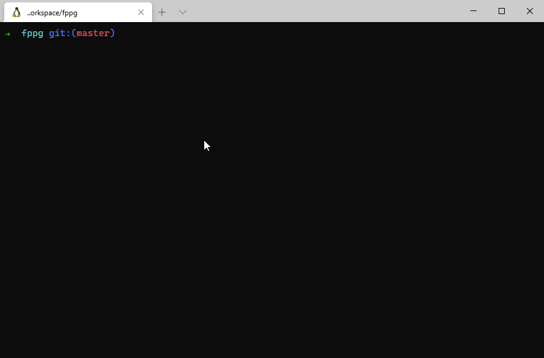
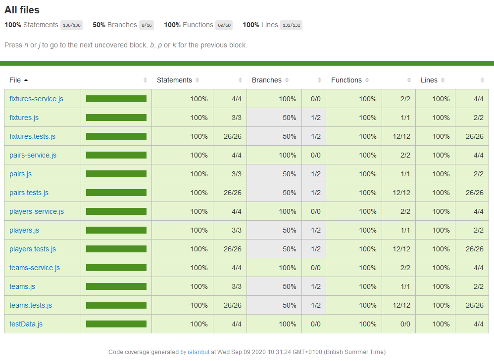
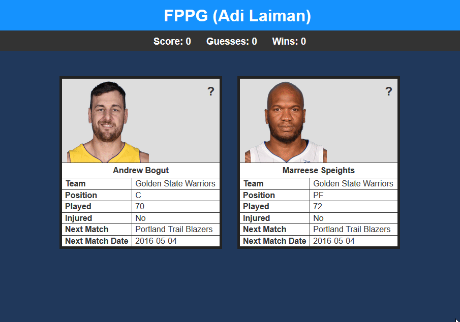

# FPPG (Adi Laiman)
## 1 Roadmap

### 1.1 Main Tasks
- [x] Crash course React over weekend
- [x] Load remote JSON, and store in collections
- [x] Display data on card object
- [x] Make pairs collection, for card pairings
- [x] Display two random cards using a pair
- [x] Add SimplSchema, Validated Methods and PropTypes
- [x] Unit Tests
- [x] Add code coverage tool
- [x] Refactor, add comments and JSDOC comments
- [x] Implement basic styling (I suck at design!)

### 1.2 Bugs
- [x] ~~Able to select two cards before next round~~
- [ ] MongoDB and React sync issues on startup
- [ ] Pairs are able to repeat due to sync issues

---
## 2 How to deploy on a local machine

### 2.1 Installing Meteor
Install meteor
```BASH
https://www.meteor.com/

<Install instructions from the Meteor website>
<MacOS/Linux>
curl https://install.meteor.com/ | sh 

<Windows>
<1 Install Chocolatey>
https://chocolatey.org/install

<2 Install Meteor via Choco>
choco install meteor
```

### 2.2 Running Meteor
```BASH
cd <cloned repo folder>
meteor npm install
meteor
```


If you still get package errors after running these commands you will need to run
```BASH
meteor npm rebuild
```

### 2.3 Run MochaJS unit tests
```BASH
meteor test --driver-package meteortesting:mocha --full-app
```


### 2.4 Run Meteor Mocha Code Coverage
```BASH
meteor npm install --save-dev babel-plugin-istanbul

BABEL_ENV=COVERAGE COVERAGE=1 COVERAGE_VERBOSE=1 COVERAGE_APP_FOLDER=$PWD/ TEST_WATCH=1 meteor test --driver-package meteortesting:mocha
```

If you do not see any green on the code coverage page, please refresh the page, as code coverage takes a small amount of time to load before generating an up to date html document.



### 2.5 How to play
Simply click on the card you think has the higher FPPG score. You need to guess 10 FPPG scores correctly before obtaining 1 win.



## 3 Epilogue
### 3.1 Footnotes
Fun project! However due to lack of experience and time with React and using it with Meteor, there is a sync issue between rendering the components and getting data back from MongoDB collections. I suspect that this is the root cause of the left over bugs before I ran out of time. If you have any suggestions or if you know how to sync, please feel free to leave a pull request! Thanks for taking your time to check out my submission! :)